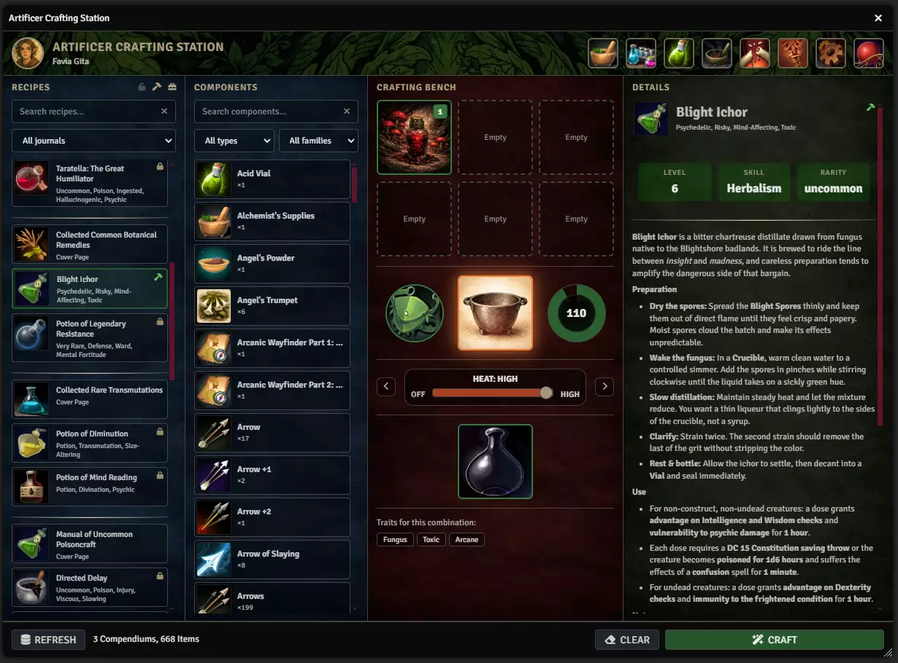

# Coffee Pub Artificer

**Audience:** anyone arriving at this wiki

Artificer adds gathering, recipes and crafting to a D&D 5e world in Foundry VTT. Players forage a scene
for raw components — herbs, ores, gems, creature parts, essences — and work what they find into potions,
poisons, food, materials and gear at a crafting station. A GM configures which components a scene yields
and how hard they are to find, and can author new components, recipes and even new crafting processes
without writing code.

It requires [Coffee Pub Blacksmith](https://github.com/Drowbe/coffee-pub-blacksmith/wiki), which owns the
menubar Artificer lives in, the chat cards it posts, the pins it drops on the map, and the scene
information it reads.

## Start here

- **[Getting started](userguides/userguide-getting-started.md)** — the first five minutes: give a scene a
  habitat, forage, harvest, craft. Start here.

Then, by what you are doing:

- **[Crafting](userguides/userguide-crafting.md)** — the bench, processes, and what success and failure produce.
- **[Recipes and blueprints](userguides/userguide-recipes.md)** — reading, writing and importing them.
- **[Gathering and harvesting](userguides/userguide-gathering.md)** — scene setup and the discovery loop.
- **[Authoring content](userguides/userguide-authoring-content.md)** — your own components, tools and processes.
- **[Skills and perks](userguides/userguide-skills.md)** — crafting skills, and what is not built yet.
- **[Settings](userguides/userguide-settings.md)** — compendiums, rulesets, and the lookup-order trap.

## How it is built

For changing Artificer, or for another module that has to work alongside it.

- **[Artificer](architecture/architecture-artificer.md)** — the map: how the module is put together and why.
- **[Overview](architecture/architecture-overview.md)** — the crafting model, and how types, families and traits relate.
- **[Gathering](architecture/architecture-gathering.md)** — the discovery and harvest loop.
- **[Skills](architecture/architecture-skills.md)** — how character skills map onto crafting and gathering.
- **[Recipe journal cover](architecture/architecture-recipe-journal-cover.md)** — how a recipe journal renders.

## Elsewhere

- **[Blacksmith wiki](https://github.com/Drowbe/coffee-pub-blacksmith/wiki)** — the hub's API reference.
  Anything Artificer consumes is documented there rather than repeated here.
