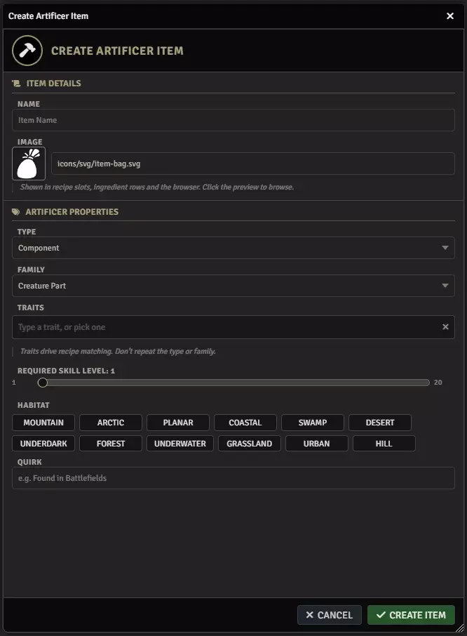
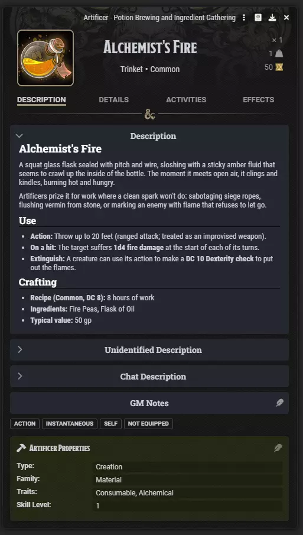

# Authoring content

**Audience:** a GM adding their own components, creations, tools and processes

Artificer ships enough content to play with, but the system is built to be extended without writing code.
This covers making your own.

## Making an item

**Create Artificer Item** in the menubar, GM only.

Every Artificer item carries four things:

**Type** -- what role it plays. **Component** is raw material found in the world. **Creation** is
something crafted. **Tool** is the apparatus, containers and processes that do the work.

**Family** -- the kind within the type.

| Type | Families |
|---|---|
| Component | CreaturePart, Environmental, Essence, Gem, Mineral, Plant |
| Creation | Food, Material, Poison, Potion |
| Tool | Apparatus, Container, Process |

**Traits** -- two to five words describing what the item is good for. **These drive recipe matching**, so
choose them as data rather than flavour, and do not repeat the type or family in them.

**Skill Level** -- crafting difficulty from 1 to 20. Roughly: 1-3 common, 4-9 uncommon, 10-14 rare, 15-19
very rare, 20 legendary.

Components additionally take **habitats**, which is where they occur, and an optional **quirk** -- a note
like "degrades in sunlight". An Essence takes an **affinity**.

**A Component with no habitat can never be gathered, and an Essence with no affinity can never be matched
by a recipe.** Both are required for that reason, and importing content that omits them now fails rather
than quietly producing unreachable items.

## An Artificer item is a real 5e item

The Artificer fields are a block on the ordinary item sheet, not a separate kind of document.

That means an item can be both a crafting material and a usable thing. A healing herb can be chewed, a
poison applied, a magical crystal can have a Use activity. **Give the item the 5e type and activities that
effect needs** rather than reducing it to a trinket. Only raw ores and pure reagents with no use effect
are correctly plain loot.

Never put Component, Creation or Tool in the 5e item type. Those are Artificer's vocabulary and the two
are unrelated.

## Making a process

A process is how crafting work is done -- Heat, Grind, Brew, Ferment. **Processes are items**, which is
what lets you add new ones without code.

Set Type to Tool and Family to **Process**, and the window reveals the process fields:

**Four intensity positions**, each with a label and a colour. Position 0 is always the off state. The
labels are that process's own vocabulary: a heat runs Off, Low, Medium, High; a grind runs Off, Coarse,
Medium, Fine. Recipes name these labels, so choose them before recipes start referring to them.

**An animation** the crafting bench plays. Names describe the **motion, not the process** -- pulse, shake,
strike, swirl, sweep, shimmer, settle, ring, blur -- so a ferment can pulse and a sieve can shake. Naming
an effect after the first process that used it is how these things ossify.

**A sound**, optional.

**Unstable at maximum**, for a process whose full intensity flickers. True for open flame; a ferment held
at maximum is not unstable.

Nineteen processes ship in the tools compendium: Heat, Boil, Bake, Steam, Brew, Steep, Stir, Tan, Forge,
Assemble, Grind, Polish, Scribe, Stitch, Bind, Extract, Dry, Imbue and Attune.

## The shipped compendiums

Artificer ships eight packs. Four are the core set and are enabled by default: **components**,
**creations**, **tools**, and **recipes and blueprints**. Four are "enhanced" variants of the first three
plus a user guide pack, and are opt-in.

**To use your own content**, put it in a compendium and nominate that compendium in settings -- see
[Settings](userguide-settings.md). You can configure up to ten of each.

**To modify shipped content**, import the item into your world and edit it there. The **item lookup order**
setting decides whether the world copy or the compendium copy wins, which is what makes this work.

**Do not edit the shipped packs directly.** They are replaced on every module update.

## Bulk authoring

**Import Recipes** takes recipe JSON.

For items, Blacksmith's JSON importer carries Artificer's fields: tick **Artificer Item** and the full
block is offered with per-field guidance. That path validates as it imports, so a Component missing its
habitat is rejected rather than created.
