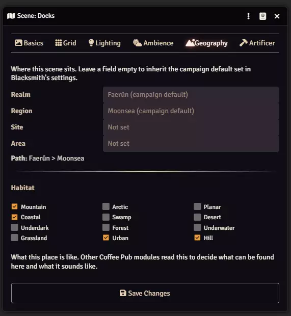
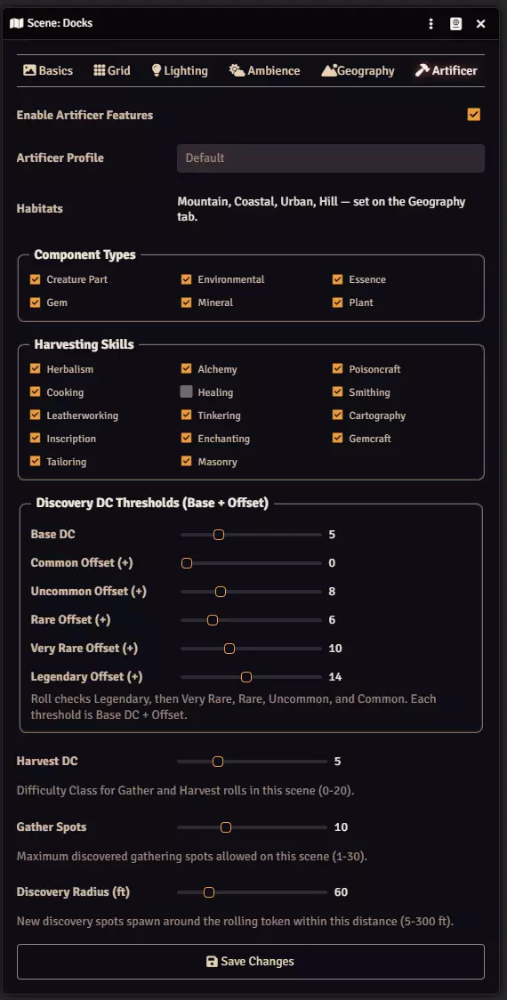

# Gathering and harvesting

**Audience:** someone playing or running a game with Artificer

Gathering is how raw components enter the game. Characters search a scene for gathering spots, then work
the spots they find. What can be found depends on where the scene is.

## Setting a scene up

Two tabs in Scene Configuration, and only one of them is Artificer's.

### Habitat, on the Geography tab

**Habitat is global and Artificer only reads it.** It belongs to Blacksmith, because it describes the
scene as a *place* rather than as a gathering site, and other Coffee Pub modules read the same value --
Minstrel uses it to choose ambient audio. Setting Forest on a scene tells the whole suite where it is.

That is why there is no habitat control on the Artificer tab. If the habitats are wrong, change them here
and every module follows.

**A habitat is the only thing a scene needs.** There is no switch to turn Artificer on for a scene:
installing the module is the opt-in. A scene with a habitat and nothing else configured yields every
component family that habitat supports, using the DCs and skills from your rulesets.

### Tuning, on the Artificer tab

Everything here narrows the default rather than enabling anything.

| Control | What it does |
|---|---|
| **Habitats** | Read-only, mirroring the Geography tab so you can confirm without switching. |
| **Component Types** | Which families occur here: Creature Part, Environmental, Essence, Gem, Mineral, Plant. |
| **Harvesting Skills** | Which skills may be rolled on this scene. |
| **Discovery DC Thresholds** | A base DC plus an offset per rarity. |
| **Harvest DC** | The difficulty of working a spot once found, 0 to 20. |
| **Gather Spots** | How many discovered spots the scene may hold at once, up to 30. |
| **Discovery Radius** | How close to the rolling token new spots appear, 5 to 300 feet. |

**The rarity offsets are how a scene stays interesting.** Rolls are checked from Legendary downward
through Very Rare, Rare, Uncommon and Common, so one roll decides both whether anything was found and how
good it was. A high roll turns up something rare; a modest one still finds common material.

The screenshot above predates the removal of the "Enable Artificer Features" switch and the unused
"Artificer Profile" box; both are gone.

## Playing it

Two tools, and the distinction matters.

**Forage and Scavenge** searches the scene. Successful rolls reveal gathering spots as pins on the map.
It finds spots; it does not collect anything.

**Gather and Harvest** works a spot that has been found. Success adds the component to the character's
inventory and consumes the spot.

Both are available to players. **Request Component Roll** is the GM's equivalent, for asking a specific
player to roll against a specific component.

## What can be found

A component is eligible when its habitat matches the scene and its family is one the scene allows.

**A component with no habitat set can be found anywhere.** That is deliberate, but it has a consequence
worth knowing: if habitat matching ever breaks, gathering does not stop -- it quietly returns only the
untagged components, which looks like a working system with a thin result.

## GM tools

**Populate Scene** places gathering spots directly, without anyone rolling for them. Useful for setting a
scene up before play.

**Clear Locations** removes them again.

Discovery pins persist on the scene. They are not hidden when a scene is reconfigured -- a discovery that
happened stays visible, because hiding it would not undo it.

## When gathering finds nothing

**Check the habitat first.** A scene with no habitat on the Geography tab cannot yield anything, and this
is by far the most common cause.

**Then check the component types.** If they have been narrowed, the scene only yields those families --
and if your component pool has nothing in those families for that habitat, the result is empty.

**Then check the pool itself.** Components come from your ingredient compendiums. If those are not
configured, or contain nothing matching the scene, there is nothing to find.
