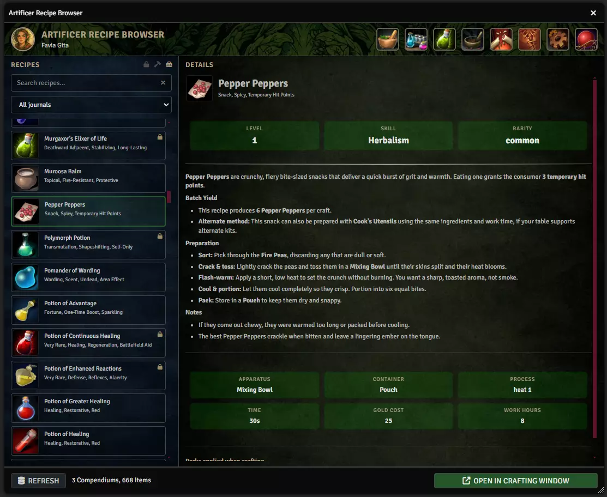

# Recipes and blueprints

**Audience:** someone playing or running a game with Artificer

A recipe says what can be made, what it takes, and how hard it is. Blueprints are the same idea for
larger constructed things. Both live as journal pages, which means they are ordinary Foundry documents
you can organise, share, and put in a compendium.

## Browsing what you can make

Open **Recipes and Blueprints** from the menubar.

The browser lists everything your world knows about, drawn from the recipe compendiums configured in
settings and from journals in the world. Use it to see what a character could work toward, not only what
they can make right now.

## Where recipes come from

Three places, and they are searched in the order your settings define:

- **The shipped compendium.** Artificer ships a recipes and blueprints pack, so a new world can craft
  immediately.
- **Compendiums you nominate.** Up to ten recipe compendiums, in priority order.
- **Journals in the world.** A recipe page in a world journal works exactly like one in a compendium.

When the same recipe name exists in more than one place, the lookup order decides which wins. That
matters more than it sounds: it decides which version the crafting station actually uses.

## What a recipe contains

A recipe page has a dedicated editor rather than a free-text body. The fields are:

| Field | What it does |
|---|---|
| **Result** | The item produced on success. |
| **Ingredients** | What is consumed. Matched by name. |
| **Apparatus** | Equipment that must be on the bench -- a still, a mortar. |
| **Container** | What the result is made in or into. |
| **Process** | How the work is done: Heat, Grind, Brew, Steep and so on. |
| **Intensity** | Which of the process's four positions the recipe wants. |
| **Skill** | The crafting skill rolled against. |
| **Skill level** | The difficulty, 1 to 20. |

**Every item-valued field is a drop target.** Drag an item onto the result, apparatus, container or an
ingredient slot to fill it. Dropping an ingredient reads its Artificer type and family from the item, so
one gesture fills three fields.

**Recipes store names, not links.** That is deliberate -- a recipe survives an item being moved between
compendiums, and resolves at craft time. The cost is that renaming an item breaks every recipe that named
it, silently, because a missing ingredient looks the same as one the character does not have.

## Writing a recipe

Create a journal page and set its type to Artificer's recipe type; the editor appears in place of the
usual text body. The description remains an ordinary rich-text field, so it keeps normal Foundry editing.

The two things worth getting right:

**Traits do the matching, so choose them as data.** A recipe finds its ingredients through the traits on
the items, not through flavour text. Two to five traits describing what the thing is good for.

**The process and intensity must exist.** The intensity names come from the process item itself, so a
recipe asking for "Simmer" only works if some process defines a position called Simmer.

## Importing recipes

**Import Recipes** in the menubar brings recipes in from JSON, for bulk authoring outside Foundry.

Artificer's item fields are also available through Blacksmith's JSON importer -- tick **Artificer Item**
when importing items and the full flag block is offered, with per-field guidance.

## Blueprints

Blueprints are handled by the same browser and the same storage model. Editing forms for blueprints are
not yet built, so a blueprint is currently authored as a journal page directly rather than through a
dedicated editor.
