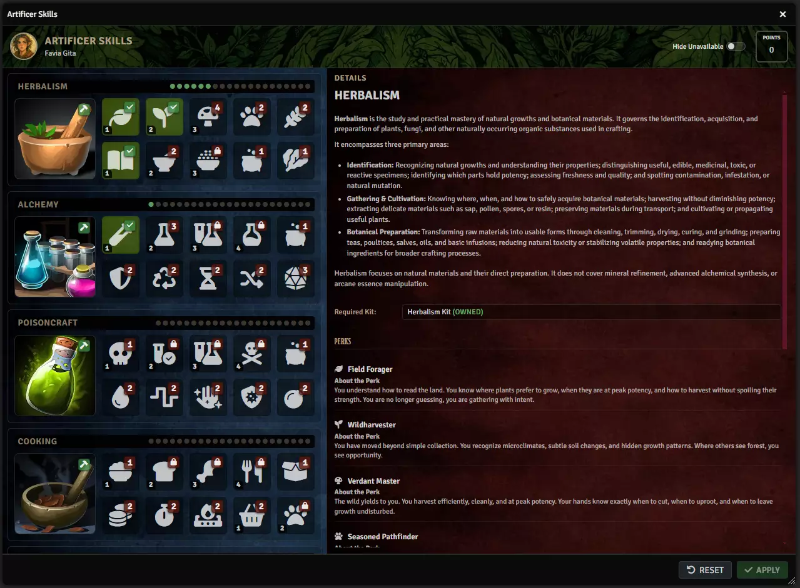

# Skills and perks

**Audience:** someone playing or running a game with Artificer

Artificer has its own crafting skills -- Herbalism, Alchemy, Smithing and the rest -- which sit alongside
the character's D&D 5e abilities rather than replacing them. A recipe names a crafting skill; the station
resolves what that means for this character.

Open **Skill Mapping** from the menubar. It is visible to everyone.

## What the window shows

Each crafting skill, what it covers, and the perks available in it. **Hide Unavailable** filters to what
the character can currently reach, and the setting is remembered between sessions.

The shipped skills are Herbalism, Alchemy, Poisoncraft, Cooking, Healing, Smithing, Leatherworking,
Tinkering, Cartography, Inscription, Enchanting, Gemcraft, Tailoring and Masonry. Which of them a scene
allows for gathering is set per scene -- see [Gathering](userguide-gathering.md).

## What perks do

A perk is a learned benefit within a skill. They are the mechanism by which two characters with the same
recipe get different results. The shipped ruleset defines perks that can:

- shift the **crafting DC**
- change the **crafting time**
- change **what a failure costs** -- the default is losing every ingredient; a perk can reduce that to half
- multiply **output on a critical success**
- add a **gathering roll bonus** or **yield multiplier**
- allow **experimental crafting**, and change its DC
- grant **automatic component gathering**
- affect **bartering**

Perks carry a cost and a set of skills they are allowed in, both defined by the ruleset rather than
hardcoded.

## What is not built yet

Two things the window implies but does not yet do, worth knowing before you plan a campaign around them:

**Skill progression and XP are not implemented.** There is no mechanism that raises a character's skill
level through use.

**Skill-level gating is not implemented.** A recipe carries a skill level, and it sets the difficulty, but
a character below that level is not blocked from attempting the recipe. They are limited by the roll.

So today the system rewards a character who has learned perks, not one who has ground a skill upward.

## Changing the skills

The whole set is a JSON ruleset, selectable in settings. Artificer ships a core mapping; point the
**Skills ruleset** setting at your own file to define different skills, different perks, or different
benefits.

Because crafting skills come from that file rather than from code, recipes are not validated against a
fixed list -- a recipe may name any skill your ruleset defines. The cost of that flexibility is that a
typo in a recipe's skill name produces a recipe whose perks never apply, rather than an error.
